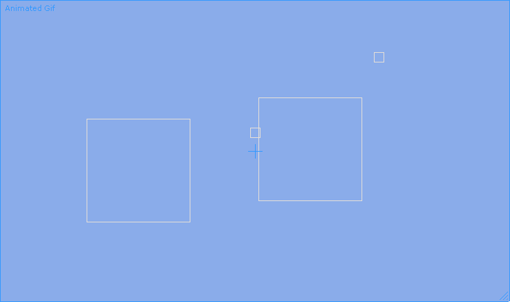

# Game Sample

The game sample demos nearly every important feature in Forge, including integration into both Unity and XNA!

## Running in Unity

Sorry, the gifs are recorded at a low FPS. The games are both actually extremely smooth due to interpolation of position data (implemented in both Unity and XNA; see the `PositionRenderer`), despite the fact that they are both only updating 15 times a second.

 

## Running in XNA

Open up XNA.sln (if you have XNA installed) to run this demo locally. This gif may look a little funny because the paddles (the big rectangles) are actually being simulated as circles.

# Overview

There are four folders.

- `Assets`: A snapshot.json and templates.json file that will allow you to start up a simple game. These inject systems and data values into the engine. Feel free to look at the JSON files; they describe the serialization format of the game. Forge save games will be serialized into another snapshot.json. One way of viewing the `Unity` editor is a designer of save-game files, and when you start a new game you're really just loading a saved file.
- `GameLogic`: Game logic that is independent from any framework. This builds directly on top of Forge APIs and implements the gameplay.
- `Unity`: Integration into the Unity game engine. This requires the Forge Unity plug-in, which will be available soon.
- `XNA`: Integration into XNA/MonoGame. This currently uses an unpublished version of the XNA Forge bindings, which will be made available soon.

# Concepts

`Forge` has a couple core concepts which allow the magic to happen. They are immutability, data, systems, and events.

In regards to immutability, and speaking very roughly, there are 3 game states in memory at all times that you game can work with; the previous state, the current state, and the future state. The previous and current states are read-only, while the future state is write-only. Systems can be notified that a data instance has been modified and then it can query the previous state to see what it's old value was. This is one of the ways in which initialization/update order are solved.

The game is composed of `IEntities` which contain `IData` instances (there are a variety of IData flavors, from ones which are Versioned (they support querying their previous states), to NonVersioned, which do not support querying, and Concurrent variants, which allow multiple writes in the same update). A data type can be something simple like your entities health or perhaps its position. Crucially, _data types contain no game logic_.

Game logic goes into `ISystems`, which are executed concurrently on multiple threads. `ISystems` can listen for a number of `Triggers`, such as when an entity has been added. Further, they can express interest in only certain types of entities, for example, a `MovementSystem` can request only entities which have `MovementData` and `PositionData`. Some of the triggers are pretty nifty, such as `Trigger.Modified`, which allows a system to be notified whenever an entity that it contains is modified (for example, the entity's position has changed). The immutability system then allows the system to query the old position even while systems are processing the entities new position.

`ISystems` do *not* deal with rendering any of the game state. Instead, the events API is used to notify the 3rd party renderer about how the simulation state has changed. Almost all of the busy work here is automated by the Unity/XNA integration packages.

Additionally, most games need to create new entities at runtime; `ITemplates` are preconfigured entities which can be instantiated at runtime. They are similar in nature to Unity's prefabs. `ITemplates` are the only way to create new `IEntity` instances at runtime.
